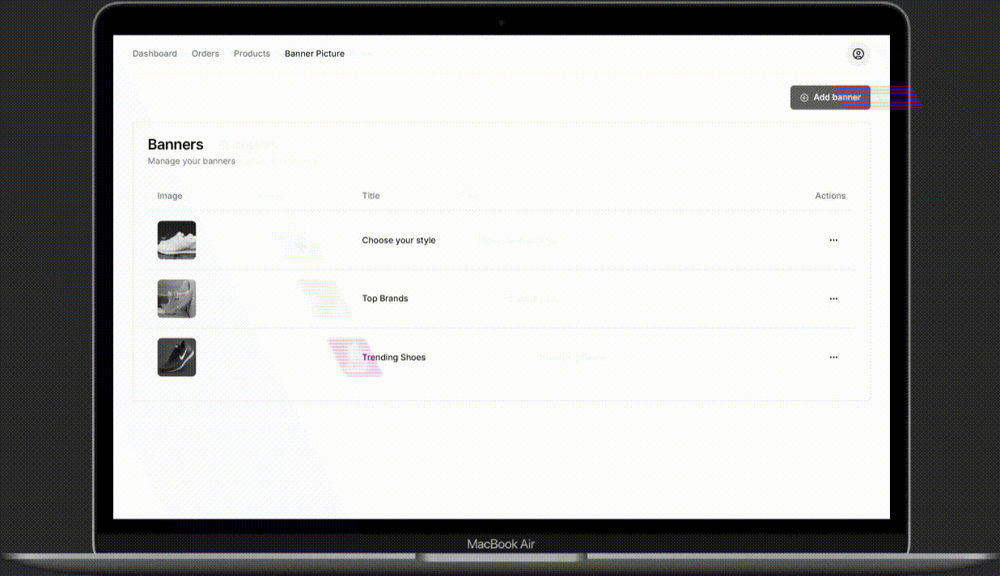
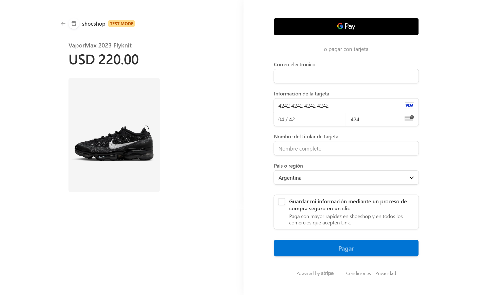

# ShoeShop

E-Commerce Store which has an admin dashboard and a storefront.

## Tech Stack

Next.js, Kinde-Auth, Neon, Prisma, Stripe, Tailwindcss, Shadcn/UI, Upstash.

## Features

🌐 Next.js App Router

🔐 Kinde Authentication with MFA

📧 Passwordless Auth

🔑 OAuth (Google and GitHub)

💰Payments using Stripe

🪝 Implementation of Stripe Webhooks

💿 Neon Database

💨 Prisma Orm

🚀 Upstash Redis for Cart functionality

📈 Recharts for displaying Charts

✅ Server Validation using Zod and Conform

🗂️ File Upload with Uploadthing

🎨 Styling with Tailwindcss and Shadcn UI

😶‍🌫️ Deployment to vercel

- React Streaming

- Stripe Checkout page

- Server side implementation

- Performance Optimized

## Live Demo

https://shoeshop-cyan.vercel.app/

## Usage/Examples

### Admin

- By default all users are admins, can test the admin dashboard in :

https://shoeshop-cyan.vercel.app/dashboard

### Users

- To test the payments you can use this fake data in checkout process :

